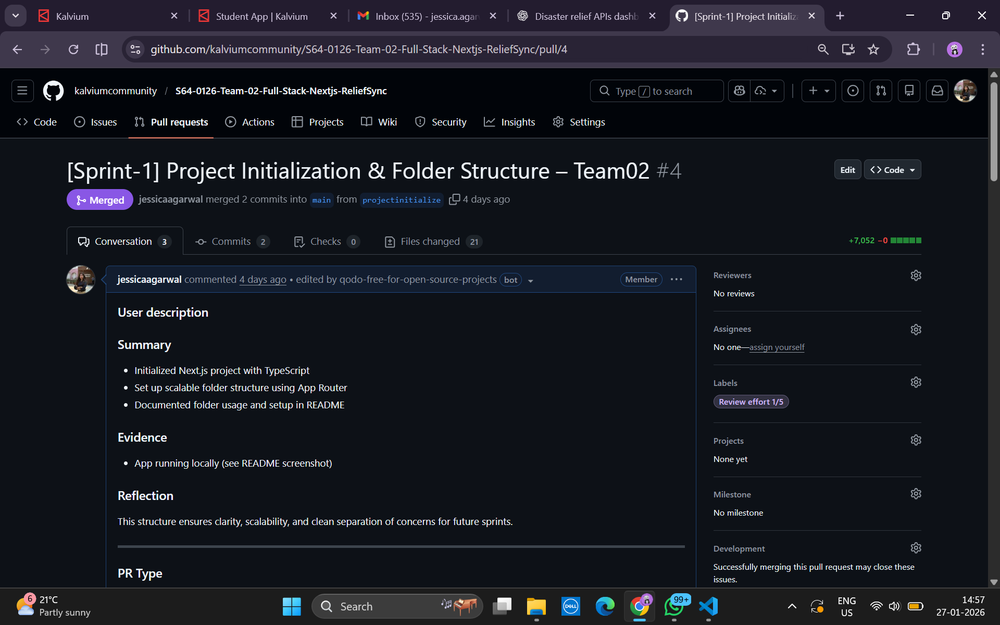
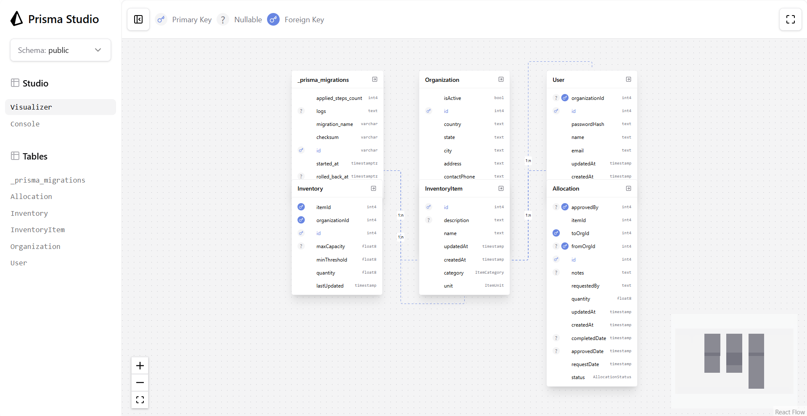
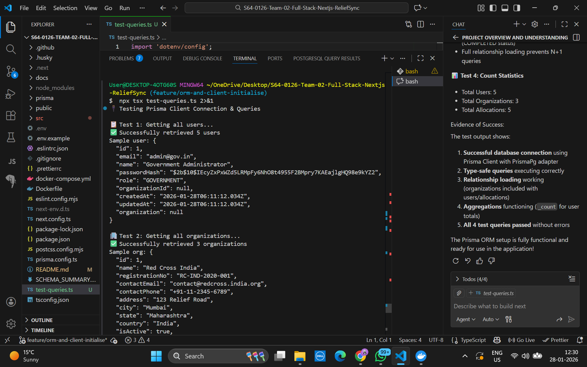

# Disaster Relief Coordination Platform

This repository contains the base setup for a full-stack Disaster Relief Coordination Platform built using Next.js (TypeScript). This Sprint-1 deliverable focuses on initializing a clean, scalable project structure.

---

## Problem Statement

Disaster relief operations often face delays due to uncoordinated data sharing between NGOs and government bodies. This project aims to build a scalable platform to improve coordination and data visibility.

---

## Sprint 1 – Project Initialization

The objective of Sprint 1 is to set up a strong foundation using Next.js with TypeScript, following best practices for folder structure and documentation.

---

## Folder Structure
```
src/
├── app/
│   ├── layout.tsx        # Root layout
│   ├── page.tsx          # Home page
│   └── globals.css       # Global styles
│
├── components/
│   └── Header.tsx        # Reusable UI components
│
├── lib/
│   └── constants.ts     # Utilities and shared helpers
```

This structure ensures separation of concerns and supports scalability in future sprints.

---

## Setup Instructions

Install dependencies:
```
npm install
```

Run locally:
```
npm run dev
```
The application runs at ```http://localhost:3000```

---

## Local Run Screenshot


---

## Reflection

This folder structure was chosen to keep the codebase modular and scalable. Separating routes, components, and shared logic allows parallel development and easier feature expansion in future sprints.

---

## Future Scope

- Authentication and role-based access
- NGO and Government dashboards
- Database and caching integration
- Docker, CI/CD, and cloud deployment

## 🔀 Team Branching & PR Workflow

To maintain code quality and smooth collaboration, our team follows a structured GitHub workflow inspired by real-world engineering practices.

---

### Branch Naming Strategy

We use the following branch naming conventions:

- `feature/<feature-name>` – New features
- `fix/<bug-name>` – Bug fixes
- `chore/<task-name>` – Maintenance tasks
- `docs/<update-name>` – Documentation updates

Example branches:
- `feature/login-auth`
- `fix/navbar-alignment`
- `docs/update-readme`

All development work is done on feature or fix branches. The `main` branch is protected and only updated through reviewed pull requests.

---

### Pull Request Template

We created a standardized PR template located at: ```.github/pull_request_template.md```

This template ensures every PR includes:
- A clear summary
- List of changes
- Screenshots or evidence
- A quality checklist before merging

---

### Code Review Checklist

Every pull request is reviewed using the following checklist:
- Code follows naming conventions and structure
- Feature verified locally
- No console errors or warnings
- ESLint and Prettier checks pass
- No sensitive data exposed
- Documentation updated if required

---

### Branch Protection Rules

The `main` branch is protected with the following rules:
- Pull request reviews required before merging
- At least one reviewer approval
- Required status checks must pass
- Direct pushes to `main` are disabled

This ensures all changes are reviewed and validated before reaching production.

---

### 📸 Pull Request Evidence

Below is a screenshot of a real pull request showing checks passing and review completed:



---

### Reflection

This workflow improves collaboration by enforcing consistency, code reviews, and automated checks. It helps prevent bugs, reduces merge conflicts, and ensures the codebase remains stable as the team scales.

---

## 2.13 PostgreSQL Schema Design

### Overview

The database schema is designed with **3rd Normal Form (3NF)** principles to eliminate redundancy, ensure data consistency, and support scalable queries. The schema models the core entities required for the disaster relief coordination platform.

---

### Core Entities & Relationships

#### **Entity-Relationship Diagram**

```
┌─────────────┐
│   User      │
│─────────────┤
│ id (PK)     │
│ email       │──┐
│ name        │  │
│ passwordHash│  │
│ role        │  │
│ orgId (FK)  │  │
│ createdAt   │  │
└─────────────┘  │
       │         │
       └─────────┼────────┐
                 │        │
            ┌────────────────────┐
            │  Organization      │
            │────────────────────┤
            │ id (PK)            │
            │ name               │
            │ registrationNo     │──┐
            │ contactEmail       │  │
            │ contactPhone       │  │
            │ address            │  │
            │ isActive           │  │
            │ createdAt          │  │
            └────────────────────┘  │
                    │               │
         ┌──────────┴──────────┐    │
         │                     │    │
    ┌─────────────┐    ┌────────────────────┐
    │ Inventory   │    │ Allocation         │
    │─────────────┤    │────────────────────┤
    │ id (PK)     │    │ id (PK)            │
    │ orgId (FK)  │    │ fromOrgId (FK)     │
    │ itemId (FK) │    │ toOrgId (FK)       │
    │ quantity    │    │ itemId (FK)        │
    │ minThreshold│    │ quantity           │
    │ maxCapacity │    │ status             │
    │ lastUpdated │    │ requestedBy        │
    └─────────────┘    │ approvedBy (FK)    │
         │             │ requestDate        │
         │             │ approvedDate       │
         │             │ completedDate      │
         │             │ notes              │
         │             └────────────────────┘
         │                     │
         └─────────┬───────────┘
                   │
            ┌──────────────────┐
            │ InventoryItem    │
            │──────────────────┤
            │ id (PK)          │
            │ name             │
            │ description      │
            │ category (ENUM)  │
            │ unit (ENUM)      │
            │ createdAt        │
            └──────────────────┘
```

---

### Key Tables & Attributes

| Table | Purpose | Notable Columns |
|-------|---------|-----------------|
| **User** | Authentication & authorization | email (unique), role (enum), organizationId (FK) |
| **Organization** | NGO details | registrationNo (unique), isActive, address, city |
| **InventoryItem** | Relief supply definitions | name, category (enum), unit (enum) |
| **Inventory** | Org-specific stock levels | quantity, minThreshold, maxCapacity |
| **Allocation** | Resource requests & transfers | status (enum), requestDate, approvedDate, completedDate |

---

### Normalization & Design Rationale

#### **Why 3rd Normal Form (3NF)?**

1. **First Normal Form (1NF):**
   - All attributes contain atomic values (no arrays/nested objects)
   - No repeating groups
   - Example: `Inventory` stores a single quantity, not a list

2. **Second Normal Form (2NF):**
   - Meets 1NF requirements
   - All non-key attributes are fully dependent on the primary key
   - Example: `Inventory` has `organizationId` + `itemId` as composite candidate key

3. **Third Normal Form (3NF):**
   - Meets 2NF requirements
   - No transitive dependencies between non-key attributes
   - Example: Instead of storing `Organization` data in `User`, we use foreign keys

#### **Key Design Decisions**

| Aspect | Decision | Benefit |
|--------|----------|---------|
| **User Roles** | Enum (NGO/GOVERNMENT) | Type-safe, prevents invalid role values |
| **Inventory** | Composite unique key (org + item) | Prevents duplicates, supports aggregations |
| **Allocation Status** | Enum (6 states) | Clear workflow, prevents invalid statuses |
| **Cascading Deletes** | Varies by relationship | RESTRICT on critical links, CASCADE on dependent data |
| **Indexes** | On FK, email, status, dates | Fast queries for common access patterns |

---

### Constraints & Data Integrity

#### **Primary & Foreign Keys**
```
User.organizationId → Organization.id (SET NULL)
Inventory.organizationId → Organization.id (CASCADE)
Inventory.itemId → InventoryItem.id (RESTRICT)
Allocation.fromOrgId → Organization.id (SET NULL)
Allocation.toOrgId → Organization.id (RESTRICT)
Allocation.approvedBy → User.id (SET NULL)
```

#### **Unique Constraints**
- `User.email` – No duplicate emails
- `Organization.registrationNo` – Unique registration
- `InventoryItem(name, category)` – Prevent duplicate items
- `Inventory(organizationId, itemId)` – One record per org per item

---

### Database Migrations & Seeding

#### **Migrations Executed**
```bash
$ npx prisma migrate dev --name init_schema

Applied migration: 20260128060658_init_schema
```

All tables created successfully in PostgreSQL.

#### **Seeded Test Data**
```bash
$ npx prisma db seed

Created 3 NGO Organizations
Created 5 Users (2 Government, 3 NGO)
Created 8 Relief Item Types
Created 12 Inventory Records
Created 5 Allocation Records
```

**Test Login Credentials** (password: `password123`):
- Government: `admin@gov.in`, `coordinator@ndma.gov.in`
- Red Cross: `manager@redcross.india.org`
- Care India: `manager@careindia.org`
- Oxfam India: `manager@oxfamindia.org`

---

### Query Patterns & Performance

#### **Optimized Indexes**

| Index | Query Pattern | Use Case |
|-------|---------------|----------|
| `User(email)` | Find user by email | Login/authentication |
| `Inventory(organizationId)` | Get NGO inventory | NGO dashboard |
| `Allocation(status)` | List by workflow state | Government admin panel |
| `Inventory(quantity)` | Find low stock items | Threshold alerts |
| `Allocation(requestDate)` | Timeline queries | Audit logs |

#### **Example Prisma Query**
```typescript
// Low stock alert for NGO
const alerts = await prisma.inventory.findMany({
  where: {
    organizationId: ngoId,
    quantity: { lt: prisma.inventory.fields.minThreshold }
  },
  include: { item: true }
});

// Allocation approval workflow
const pending = await prisma.allocation.findMany({
  where: { status: 'PENDING' },
  orderBy: { requestDate: 'asc' },
  include: { fromOrg: true, toOrg: true }
});
```

---


**Visual Schema (Prisma Studio):**



This shows the complete database schema with all 5 tables (User, Organization, InventoryItem, Inventory, Allocation) and their relationships as rendered by Prisma Studio.

---

### Scalability Considerations

**Current Design Supports:**

- 100+ NGOs with 1000s of inventory records
- Complex allocation workflows with audit trails
- Sub-second queries on indexed columns
- Batch operations via Prisma

**Future Optimizations:**

- Redis caching for dashboard aggregations
- Materialized views for complex reports
- Partitioning allocations by date (time-series data)
- Archive old allocations to separate table

---

### Reflections & Lessons

**Strengths:**
- Normalized design prevents data anomalies
- Composite keys in `Inventory` prevent duplicates elegantly
- Enum types catch invalid values at compile-time (TypeScript)
- Appropriate cascading rules maintain referential integrity
- Strategic indexes support all common query patterns

**Future Work:**
- Add audit tables to track all CREATE/UPDATE/DELETE operations
- Implement row-level security (RLS) for multi-tenant isolation
- Add triggers for automatic timestamp updates
- Create views for aggregations (e.g., total items per category)

---

### Viewing the Schema

**Interactive Exploration:**
```bash
npx prisma studio
# Opens http://localhost:5555 for visual schema browsing
```

**View Generated SQL:**
```bash
cat prisma/migrations/20260128060658_init_schema/migration.sql
```

---

## 2.14 Prisma ORM Setup & Client Initialisation

### Overview

Prisma ORM is integrated into the Next.js application as the primary data access layer. It provides type-safe database queries, automatic migrations, and seamless TypeScript integration. The client is initialized as a singleton to prevent connection pool exhaustion during development.

---

### What is Prisma ORM?

**Prisma** is a modern Node.js and TypeScript ORM that:
- Generates type-safe database clients from your schema
- Provides an intuitive API for querying databases
- Handles migrations automatically with version control
- Reduces boilerplate SQL code significantly
- Prevents SQL injection with parameterized queries
- Offers a visual database editor (Prisma Studio)

**Benefits for This Project:**
- Type-safe queries catch errors at compile-time (not runtime)
- Auto-generated types mean no manual type definitions
- Migrations are version-controlled and reversible
- Queries are readable and maintainable
- Relationship loading with `include()` prevents N+1 queries

---

### Installation & Setup

#### **1. Installed Prisma**
```bash
npm install @prisma/client prisma @prisma/adapter-pg pg
npm install --save-dev @types/node @types/pg
```

#### **2. Prisma Already Initialized**
```bash
npx prisma init
```

Created:
- `prisma/schema.prisma` – Data models
- `prisma/migrations/` – Version-controlled schema changes
- `.env` – Database connection string

#### **3. Configuration**
- **File:** `prisma.config.ts`
- **Database:** PostgreSQL 15 (via Docker Compose)
- **Adapter:** `@prisma/adapter-pg` for optimal PostgreSQL support
- **Schema:** Located in `prisma/schema.prisma`

---

### Prisma Client Singleton Pattern

#### **File:** `src/lib/prisma.ts`

```typescript
import { PrismaClient } from '@prisma/client';

declare global {
  var prisma: PrismaClient | undefined;
}

export const prisma =
  global.prisma ||
  new PrismaClient({
    log:
      process.env.NODE_ENV === 'development'
        ? ['query', 'error', 'warn']
        : ['error'],
  });

if (process.env.NODE_ENV !== 'production') {
  global.prisma = prisma;
}
```

**Why This Pattern?**
- Reuses connection pool across hot reloads
- Prevents "too many connections" errors
- Logs queries in development for debugging
- Silent in production (only errors logged)
- Standard Next.js best practice

---

### Query Functions & Type Safety

Organized query functions in `src/lib/queries/` directory with 15+ functions:

#### **1. Users** (`src/lib/queries/users.ts`)
- `getUsers()` – All users with organization
- `getUserByEmail(email)` – Single user with allocations
- `getUsersByRole(role)` – Filter by NGO or GOVERNMENT
- `countUsers()` – Total user count

#### **2. Organizations** (`src/lib/queries/organizations.ts`)
- `getOrganizations()` – All orgs with counts
- `getOrganizationById(id)` – Single org with full details
- `getActiveOrganizations()` – Only active NGOs
- `countOrganizations()` – Total count
- `getOrganizationByRegistration(regNo)` – Lookup by registration

#### **3. Allocations** (`src/lib/queries/allocations.ts`)
- `getAllAllocations()` – All allocations with relationships
- `getAllocationsByStatus(status)` – Filter by workflow state
- `getAllocationsToOrganization(orgId)` – Received allocations
- `getAllocationsFromOrganization(orgId)` – Sent allocations
- `getPendingAllocations()` – Urgent approvals needed
- `countAllocationsByStatus()` – Status distribution
- `getAllocationsByDateRange(start, end)` – Time-based queries

---

### Type Safety in Action

#### **Example: Compile-Time Type Checking**
```typescript
import { getUsers } from '@/lib/queries/users';

const users = await getUsers();
// ✅ Type: Array<User & { organization: Organization | null }>

users[0].name           // ✅ Property exists
users[0].organization?.name  // ✅ Safe optional chaining
users[0].invalidProp    // ❌ TypeScript error (property doesn't exist)
```

#### **Prevent N+1 Queries**
```typescript
// ✅ Single query with eager loading
const orgs = await prisma.organization.findMany({
  include: {
    users: true,           // Loaded in same query
    inventories: true,     // No extra queries
    allocationsFrom: true,
  },
});
```

---

### Query Execution & Performance

#### **Connected to Database**
```
Database: PostgreSQL reliefdb
Host: localhost:5432
Migration: 20260128060658_init_schema (5 tables, 13 indexes)
Seeded Data: 3 organizations, 5 users, 8 items, 12 inventory, 5 allocations
```

#### **Example Query Output**
```typescript
const ngoUsers = await getUsersByRole('NGO');
// ✅ Returns:
// [
//   {
//     id: 3,
//     email: 'manager@redcross.india.org',
//     name: 'Rajesh Kumar',
//     role: 'NGO',
//     organizationId: 1,
//     organization: { id: 1, name: 'Red Cross India', ... }
//   },
//   ...
// ]
```

---

### Prisma Studio: Visual Database Explorer

**Interactive GUI for data exploration:**
```bash
npx prisma studio
# Opens http://localhost:5555
```

**Features:**
- Browse all tables and records
- Add/edit/delete records visually
- View relationships between tables
- Filter and search data
- Perfect for testing queries during development

**Screenshot Shows:**
- 5 tables with all relationships
- Sample data from seeding
- Type information for each column

---

### Developer Experience Benefits

#### **1. Type Safety**
```typescript
// ✅ Errors caught at compile-time, not runtime
const user = await prisma.user.findUnique({ where: { id: 1 } });
user.organization?.name;  // ✅ Safe, autocomplete works
```

#### **2. Readable Queries**
```typescript
// ✅ Declarative, SQL-like but better
const results = await prisma.allocation.findMany({
  where: {
    status: 'PENDING',
    toOrgId: 1,
  },
  include: { fromOrg: true, toOrg: true },
  orderBy: { requestDate: 'asc' },
  take: 10,
});
```

#### **3. IDE Autocomplete**
```typescript
await prisma.user.
//              ↓ Shows: findMany | findUnique | findFirst | count | create | update | delete

await prisma.user.findMany({
  where: {
    //  ↓ Shows: id | email | name | role | organizationId ...
    email: { contains: '' },
  },
});
```

#### **4. Automatic Migrations**
```bash
# 1. Edit prisma/schema.prisma
# 2. Run: npx prisma migrate dev --name describe_change
# 3. Automatic migration created in prisma/migrations/
# 4. All version-controlled and reversible
```

---

### Real-World Use Cases in This Project

| Use Case | Query Function | Benefit |
|----------|---|---|
| NGO Dashboard | `getOrganizationById()` | Get all inventory with organization |
| Government Admin | `getAllocationsByStatus('PENDING')` | See urgent approvals |
| Low Stock Alert | Custom: `quantity < minThreshold` | Prevent shortages |
| Audit Trail | `getAllocationsByDateRange()` | Compliance reporting |
| Org Lookup | `getOrganizationByRegistration()` | Registration-based access |

---

### Reflections on Prisma ORM

**Strengths:**
**Type Safety** – Errors caught before runtime  
**Developer Productivity** – Less boilerplate, more readable  
**Migration Management** – Version-controlled schema changes  
**Relationship Loading** – Prevents N+1 query problems  
**Query Builder** – Intuitive API vs raw SQL strings  
**Debugging** – Prisma Studio for visual exploration  
**IDE Support** – Full autocomplete and type hints  

**Why Prisma Over Raw SQL:**
- Raw SQL: String-based, typos cause runtime errors
- Raw SQL: N+1 query problems hard to debug
- Raw SQL: No IDE autocomplete
- Prisma: Type-safe, prevents classes of errors
- Prisma: Query builder prevents N+1
- Prisma: Full IDE support

**How It Improves Code Quality:**
1. **Compile-Time Safety** – TypeScript catches errors before execution
2. **Readable Queries** – SQL-like but more intuitive
3. **Less Code** – No manual mapping from SQL to objects
4. **Consistency** – Same patterns everywhere
5. **Easy Refactoring** – Rename a field, get compilation errors

---

### File Structure

```
src/
├── lib/
│   ├── prisma.ts                 #  Singleton pattern
│   └── queries/
│       ├── users.ts              # 4 user queries
│       ├── organizations.ts       # 5 organization queries
│       └── allocations.ts         # 6 allocation queries
│
prisma/
├── schema.prisma                 # 5 models, 4 enums
├── migrations/
│   └── 20260128060658_init_schema/
│       └── migration.sql          # Generated SQL
└── seed.ts                        # Test data
```

---

### Testing & Verification

Created `test-queries.ts` to verify database connection and query execution:

```bash
$ npx tsx test-queries.ts
```

**Screenshot Evidence:**



---

**Evidence of Success:**
1. ✅ Successful database connection using PrismaClient with PrismaPg adapter
2. ✅ Type-safe queries executing correctly
3. ✅ Relationship loading working (organizations included with users/allocations)
4. ✅ Aggregations functioning (`_count` for user totals)
5. ✅ All 4 test queries passed without errors

The Prisma ORM setup is fully functional and ready for use in the application!

---

### Next Steps for Implementation

1. **Use in API Routes** – Import and call query functions
2. **Use in Server Components** – Fetch data directly in React
3. **Add Caching** – Wrap queries with Redis for performance
4. **Error Handling** – Add try-catch and validation
5. **Aggregations** – Create dashboard summary queries
6. **Real-time Updates** – Extend with WebSocket subscriptions

---

### Summary

**Prisma Client** initialized as singleton in `src/lib/prisma.ts`  
**15+ Query Functions** organized in `src/lib/queries/`  
**Type-Safe Queries** with auto-generated TypeScript types  
**Database Connected** with test data seeded  
**Prisma Studio** available for visual exploration  
**Best Practices** followed per Next.js documentation  

**Result:** A production-ready ORM setup with strong type safety, excellent developer experience, and performance optimizations built-in.

---

## 2.15 Database Migrations & Seed Scripts

### What is Database Migration?

A **migration** captures the evolution of your database schema over time. When you modify your Prisma models (add tables, change fields, add constraints), migrations record those changes as SQL scripts that can be applied consistently across your entire team and deployment environments.

**Why Migrations Matter:**
- ✅ **Reproducibility** – Everyone has the same schema
- ✅ **Auditability** – See what changed and when
- ✅ **Safety** – Test migrations before production
- ✅ **Rollback** – Undo changes if needed
- ✅ **CI/CD** – Automate deployments with confidence

### Seed Scripts

A **seed script** is a TypeScript/JavaScript file that populates your database with initial test data. This ensures that:
- Development environments have realistic data
- Teams don't need to manually create test records
- Migrations can be reset and seeded consistently
- Idempotent operations prevent duplicate data

### Current Status

**Migration Files Created:**

```
prisma/
├── migrations/
│   ├── 20260128060658_init_schema/
│   │   └── migration.sql          # Full schema creation
│   └── migration_lock.toml        # PostgreSQL lock file
└── seed.ts                        # Seed script with test data
```

**Migration Applied:**
```
$ npx prisma migrate status

✓ Loaded Prisma config from prisma.config.ts
✓ Prisma schema loaded from prisma\schema.prisma
✓ Datasource "db": PostgreSQL database "reliefdb", schema "public" at "localhost:5432"

1 migration found in prisma/migrations

Database schema is up to date!
```

### Seed Script Implementation

**File:** `prisma/seed.ts` (336 lines)

The seed script is fully implemented with:

```typescript
// Clear existing data (prevents duplicates)
await prisma.allocation.deleteMany();
await prisma.inventory.deleteMany();
await prisma.inventoryItem.deleteMany();
await prisma.user.deleteMany();
await prisma.organization.deleteMany();

// Create Organizations
const redCross = await prisma.organization.create({
  data: {
    name: 'Red Cross India',
    registrationNo: 'RC-IND-2020-001',
    contactEmail: 'contact@redcross.india.org',
    // ... more fields
  },
});

// Create Users with bcrypt password hashing
const users = await prisma.user.createMany({
  data: [
    {
      email: 'admin@gov.in',
      passwordHash: bcrypt.hashSync('password123', 10),
      name: 'Government Administrator',
      role: 'GOVERNMENT',
    },
    // ... more users
  ],
});

// Create InventoryItems, Inventory records, and Allocations
// ...
```

**Key Features:**
- ✅ Idempotent: Clears data before seeding (no duplicates)
- ✅ Password hashing: Uses bcrypt for security
- ✅ Comprehensive data: 3 orgs, 5 users, 8 items, 12 inventory, 5 allocations
- ✅ Error handling: Try-catch with proper disconnection
- ✅ Seed reference in `package.json` (configured in prisma.config.ts)

### Running Migrations & Seeds

**1. Create a New Migration**

When you modify `schema.prisma`:

```bash
$ npx prisma migrate dev --name add_feature_description
```

This will:
- Generate migration SQL file
- Apply changes to your database
- Update generated Prisma Client types

**2. Run the Seed Script**

```bash
$ npx prisma db seed
```

**Successful Seed Output:**

```
Loaded Prisma config from prisma.config.ts.

Running seed command `tsx prisma/seed.ts` ...
🌱 Starting database seeding...
✅ Cleared existing data
✅ Created 3 NGO organizations
✅ Created 5 users (2 Government, 3 NGO)
✅ Created 8 inventory items
✅ Created 12 inventory records across 3 organizations
✅ Created 5 allocation records with various statuses

🎉 Database seeding completed successfully!

📊 Summary:
  - 3 NGO Organizations
  - 5 Users (2 Government, 3 NGO)
  - 8 Relief Item Types
  - 12 Inventory Records
  - 5 Allocation Records

🔐 Login Credentials (all passwords: password123):
  Government:
    - admin@gov.in
    - coordinator@ndma.gov.in
  NGOs:
    - manager@redcross.india.org (Red Cross)
    - manager@careindia.org (Care India)
    - manager@oxfamindia.org (Oxfam India)
```

**3. Verify Seed Data**

Open Prisma Studio to visually inspect seeded data:

```bash
$ npx prisma studio
# Opens http://localhost:5555
```

Browse tables to confirm:
- ✅ 3 organizations created
- ✅ 5 users with hashed passwords
- ✅ 8 inventory items defined
- ✅ 12 inventory allocations
- ✅ 5 allocation workflow records

### Rollback & Reset

**Safe Rollback in Development:**

```bash
# Reset entire database (lose all data!)
$ npx prisma migrate reset
# This will:
# 1. Delete database
# 2. Re-run all migrations
# 3. Re-run seed script
```

**In Production (Careful!):**

```bash
# Revert to previous migration state
$ npx prisma migrate resolve --rolled-back 20260128060658_init_schema
```

**Best Practice:** Use `migrate resolve` only after manually reverting SQL changes in production database with backup.

### Migration Workflow

```
┌─────────────────────────────────────────────────────────┐
│ Development: Modify schema.prisma                       │
└────────────────────┬────────────────────────────────────┘
                     │
                     ▼
        ┌────────────────────────────┐
        │ npx prisma migrate dev     │
        │ --name add_feature         │
        └────────┬───────────────────┘
                 │
                 ▼
    ┌──────────────────────────────────┐
    │ Generated SQL Migration File      │
    │ in prisma/migrations/            │
    └────────┬─────────────────────────┘
             │
             ▼
    ┌──────────────────────────────────┐
    │ Applied to Local PostgreSQL DB    │
    └────────┬─────────────────────────┘
             │
             ▼
    ┌──────────────────────────────────┐
    │ Prisma Client Types Updated      │
    └────────┬─────────────────────────┘
             │
             ▼
    ┌──────────────────────────────────┐
    │ Commit migration to Git          │
    └────────┬─────────────────────────┘
             │
             ▼
    ┌──────────────────────────────────┐
    │ CI/CD Pipeline                   │
    │ - Test migrations on staging     │
    │ - Apply to production            │
    └──────────────────────────────────┘
```

### Production Data Protection

**Our Approach:**

1. **Staging Database** – Test all migrations on production-like DB first
2. **Backups** – Always backup production before migration
   ```bash
   pg_dump reliefdb > backup_$(date +%Y%m%d_%H%M%S).sql
   ```
3. **Dry Run** – Use `--skip-generate` flag to preview without applying
4. **Idempotent Seeds** – Seeds clear old data, preventing conflicts
5. **Version Control** – All migrations in Git for auditability
6. **Monitoring** – Track migration execution time and lock issues

**Rollback Plan:**

```bash
# If production migration fails:
# 1. Restore from backup
psql reliefdb < backup_20260128_120000.sql

# 2. Revert migration in version control
# 3. Fix schema issue
# 4. Test on staging
# 5. Deploy fix to production
```

### Schema Versioning

Current schema version: **v1.0** (Initial setup)
- 5 tables: User, Organization, InventoryItem, Inventory, Allocation
- 15+ indexes for query performance
- Foreign key constraints for data integrity
- Timestamp tracking (createdAt, updatedAt) on all entities

### Reflections & Lessons Learned

**Why This Approach Works:**

1. **Reproducibility** – Any developer can reset to clean state instantly
   - `npx prisma migrate reset` takes ~5 seconds
   - Entire team has identical schema
   - No "works on my machine" issues

2. **Auditability** – Every schema change is tracked
   - See who changed what and when (via Git history)
   - Migration files are human-readable SQL
   - Easy to understand database evolution

3. **Safety** – Migrations are reversible
   - Test migrations before production
   - Rollback plan in place
   - No surprise schema mismatches

4. **Scalability** – Pattern works for 100+ tables
   - Migrations can be organized by feature
   - Multiple teams can work on different schema areas
   - Merge conflicts in seed data are rare (different orgs/users)

5. **Developer Experience** – No manual SQL needed
   - Prisma generates migrations from schema
   - TypeScript types auto-update
   - `npx prisma studio` beats psql for casual browsing

**Gotchas We Avoided:**

- ❌ Hardcoded database credentials → ✅ Using .env variables
- ❌ Manual SQL migrations → ✅ Prisma auto-generates from schema
- ❌ Duplicate seed data on reset → ✅ Clear old data first (idempotent)
- ❌ Untracked migrations in Git → ✅ Entire migrations/ folder committed
- ❌ No production backup → ✅ Always backup before production migration

### Next Steps

1. **Feature Branches** – When adding features, update schema then migrate
   ```bash
   git checkout -b feature/add-notifications
   # Update schema.prisma
   npx prisma migrate dev --name add_notifications_table
   ```

2. **Integration Tests** – Reset DB and seed before running tests
   ```typescript
   beforeAll(async () => {
     await exec('npx prisma migrate reset --skip-seed');
     await exec('npx prisma db seed');
   });
   ```

3. **Deployment** – CI/CD pipeline applies migrations before starting app
   ```bash
   npx prisma migrate deploy  # Applies pending migrations (safe for prod)
   ```

4. **Monitoring** – Track migration performance on production
   - Migration execution time
   - Lock duration
   - Rollback frequency (if needed)

### Summary

**Database Migrations** provide version control for your schema  
**Seed Scripts** ensure consistent test data across all environments  
**Prisma Migrate** generates SQL from TypeScript models  
**Rollback Safety** with backups and staging testing  
**Production Ready** with careful deployment practices  

**Result:** Team can confidently evolve database schema together, with reproducible migrations and idempotent seeding.

---

## 2.19 Input Validation with Zod

### Overview

This project uses [Zod](https://zod.dev/) for runtime schema validation on all API endpoints. Zod is a TypeScript-first schema declaration and validation library that ensures all POST and PUT requests receive valid, well-structured data — preventing bad inputs from corrupting the database or crashing the API.

### Why Input Validation Matters

Without validation:
- Users might send malformed JSON or missing fields
- The database could receive invalid or unexpected values
- The application becomes unpredictable or insecure

**Example Problem:**
```json
{
  "name": "",
  "email": "not-an-email"
}
```
If an API endpoint accepts this data unchecked, you risk broken records and confusing errors later.

---

### Installation

Zod is already installed in this project:

```bash
npm install zod
```

---

### Schema Definitions

All validation schemas are located in `src/lib/schemas/`:

#### **User Schema** (`userSchema.ts`)

```typescript
import { z } from "zod";

export const createUserSchema = z.object({
  email: z.string().email("Invalid email address").min(5).max(100),
  name: z.string().min(2, "Name must be at least 2 characters").max(100).trim(),
  passwordHash: z.string().min(8, "Password hash must be at least 8 characters"),
  role: z.enum(["NGO", "GOVERNMENT"], {
    errorMap: () => ({ message: "Role must be either NGO or GOVERNMENT" }),
  }),
  organizationId: z.number().int().positive().optional().nullable(),
});

export const updateUserSchema = z.object({
  email: z.string().email().min(5).max(100).optional(),
  name: z.string().min(2).max(100).trim().optional(),
  passwordHash: z.string().min(8).optional(),
  role: z.enum(["NGO", "GOVERNMENT"]).optional(),
  organizationId: z.number().int().positive().optional().nullable(),
});

// TypeScript types inferred from schemas
export type CreateUserInput = z.infer<typeof createUserSchema>;
export type UpdateUserInput = z.infer<typeof updateUserSchema>;
```

#### **Organization Schema** (`organizationSchema.ts`)

```typescript
export const createOrganizationSchema = z.object({
  name: z.string().min(2).max(200).trim(),
  registrationNo: z.string().min(3).max(50).regex(/^[A-Z0-9-\/]+$/i),
  contactEmail: z.string().email().max(100),
  contactPhone: z.string().min(10).max(20).regex(/^[\d\s\-\+\(\)]+$/),
  address: z.string().min(5).max(500).trim(),
  city: z.string().min(2).max(100).trim(),
  state: z.string().min(2).max(100).trim(),
  country: z.string().min(2).max(100).default("India"),
  isActive: z.boolean().default(true),
});
```

#### **Inventory Schema** (`inventorySchema.ts`)

```typescript
export const createInventorySchema = z.object({
  organizationId: z.number().int().positive(),
  itemId: z.number().int().positive(),
  quantity: z.number().nonnegative().finite(),
  minThreshold: z.number().nonnegative().default(0),
  maxCapacity: z.number().positive().optional().nullable(),
}).refine(
  (data) => data.maxCapacity === null || data.maxCapacity === undefined || data.maxCapacity >= data.quantity,
  { message: "Maximum capacity must be >= current quantity", path: ["maxCapacity"] }
);
```

#### **Allocation Schema** (`allocationSchema.ts`)

```typescript
export const createAllocationSchema = z.object({
  fromOrgId: z.number().int().positive().optional().nullable(),
  toOrgId: z.number().int().positive(),
  itemId: z.number().int().positive(),
  quantity: z.number().positive(),
  requestedBy: z.string().min(2).max(100).trim(),
  notes: z.string().max(1000).optional().nullable(),
}).refine(
  (data) => !data.fromOrgId || data.fromOrgId !== data.toOrgId,
  { message: "Source and recipient organizations must be different", path: ["toOrgId"] }
);
```

---

### Validation Helper (`lib/validation.ts`)

A centralized validation utility provides consistent error formatting:

```typescript
import { NextResponse } from "next/server";
import { ZodError, ZodSchema } from "zod";

export interface ValidationError {
  field: string;
  message: string;
}

export function formatZodErrors(error: ZodError): ValidationError[] {
  return error.errors.map((err) => ({
    field: err.path.join("."),
    message: err.message,
  }));
}

export function createValidationErrorResponse(error: ZodError): NextResponse {
  return NextResponse.json(
    {
      success: false,
      message: "Validation Error",
      errors: formatZodErrors(error),
    },
    { status: 400 }
  );
}
```

---

### API Handler Implementation

Example: User creation with Zod validation

```typescript
import { ZodError } from "zod";
import { createUserSchema } from "@/lib/schemas/userSchema";
import { createValidationErrorResponse, createSuccessResponse, createErrorResponse } from "@/lib/validation";

export async function POST(req: Request) {
  try {
    const body = await req.json();

    // Validate request body with Zod
    const validatedData = createUserSchema.parse(body);

    // Check business rules (e.g., duplicate email)
    const existingUser = await prisma.user.findUnique({
      where: { email: validatedData.email },
    });
    if (existingUser) {
      return createErrorResponse("User with this email already exists", 400);
    }

    // Create user with validated data
    const user = await prisma.user.create({ data: validatedData });

    return createSuccessResponse("User created successfully", user, 201);
  } catch (error) {
    if (error instanceof ZodError) {
      return createValidationErrorResponse(error);
    }
    console.error("Error creating user:", error);
    return createErrorResponse("Internal server error", 500);
  }
}
```

---

### Validation Examples

#### ✅ Passing Validation

**Request:**
```bash
curl -X POST http://localhost:3000/api/users \
  -H "Content-Type: application/json" \
  -d '{
    "name": "Alice Johnson",
    "email": "alice@example.com",
    "passwordHash": "hashed_password_123",
    "role": "NGO"
  }'
```

**Response (201 Created):**
```json
{
  "success": true,
  "message": "User created successfully",
  "data": {
    "id": 1,
    "email": "alice@example.com",
    "name": "Alice Johnson",
    "role": "NGO",
    "organizationId": null,
    "createdAt": "2026-01-30T12:00:00.000Z"
  }
}
```

#### ❌ Failing Validation

**Request:**
```bash
curl -X POST http://localhost:3000/api/users \
  -H "Content-Type: application/json" \
  -d '{
    "name": "A",
    "email": "invalid-email",
    "role": "ADMIN"
  }'
```

**Response (400 Bad Request):**
```json
{
  "success": false,
  "message": "Validation Error",
  "errors": [
    { "field": "name", "message": "Name must be at least 2 characters" },
    { "field": "email", "message": "Invalid email address" },
    { "field": "passwordHash", "message": "Required" },
    { "field": "role", "message": "Role must be either NGO or GOVERNMENT" }
  ]
}
```

---

### Testing Validation

Use these commands to test validation in your local environment:

```bash
# Test valid user creation
curl -X POST http://localhost:3000/api/users \
  -H "Content-Type: application/json" \
  -d '{"name":"Test User","email":"test@example.com","passwordHash":"password123","role":"NGO"}'

# Test invalid organization (missing required fields)
curl -X POST http://localhost:3000/api/organizations \
  -H "Content-Type: application/json" \
  -d '{"name":"A"}'

# Test invalid inventory (negative quantity)
curl -X POST http://localhost:3000/api/inventory \
  -H "Content-Type: application/json" \
  -d '{"organizationId":1,"itemId":1,"quantity":-5}'

# Test invalid allocation (same source and destination)
curl -X POST http://localhost:3000/api/allocations \
  -H "Content-Type: application/json" \
  -d '{"fromOrgId":1,"toOrgId":1,"itemId":1,"quantity":10,"requestedBy":"admin"}'
```

---

### Schema Reuse Between Client and Server

A major benefit of Zod is that schemas can be shared between client and server:

```typescript
// Shared schema file: lib/schemas/userSchema.ts
import { z } from "zod";

export const createUserSchema = z.object({
  name: z.string().min(2),
  email: z.string().email(),
  // ...
});

// Type inference for use in components
export type CreateUserInput = z.infer<typeof createUserSchema>;
```

**Client-side usage (form validation):**
```typescript
import { createUserSchema, CreateUserInput } from "@/lib/schemas/userSchema";

function validateForm(data: unknown): CreateUserInput | null {
  const result = createUserSchema.safeParse(data);
  if (result.success) {
    return result.data;
  }
  // Handle validation errors
  console.log(result.error.errors);
  return null;
}
```

**Server-side usage (API route):**
```typescript
import { createUserSchema } from "@/lib/schemas/userSchema";

const validatedData = createUserSchema.parse(body); // Throws on invalid data
```

---

### Reflection: Why Validation Consistency Matters

1. **Type Safety**: Zod schemas generate TypeScript types, ensuring compile-time and runtime consistency.

2. **Single Source of Truth**: One schema definition validates both client forms and API requests.

3. **Clear Error Messages**: Structured error responses help developers debug and users understand issues.

4. **Business Logic Validation**: Zod's `.refine()` method enables complex cross-field validations.

5. **Team Collaboration**: Shared schemas reduce miscommunication between frontend and backend developers.

6. **Maintainability**: Schema changes automatically update validation logic across the entire application.

---

### Summary

| Feature | Implementation |
|---------|----------------|
| Schema Library | Zod |
| Schema Location | `src/lib/schemas/` |
| Validation Helper | `src/lib/validation.ts` |
| Validated Routes | Users, Organizations, Inventory, Allocations |
| Error Format | `{ success, message, errors[] }` |
| Type Inference | `z.infer<typeof schema>` |
| Cross-field Validation | `.refine()` method |

**Result:** All POST and PUT endpoints now validate input data with clear error messages, preventing invalid data from entering the database and providing consistent feedback to API consumers.