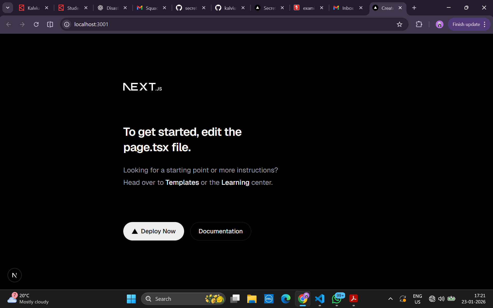

# Disaster Relief Coordination Platform

This repository contains the base setup for a full-stack Disaster Relief Coordination Platform built using Next.js (TypeScript). This Sprint-1 deliverable focuses on initializing a clean, scalable project structure.

---

## Problem Statement

Disaster relief operations often face delays due to uncoordinated data sharing between NGOs and government bodies. This project aims to build a scalable platform to improve coordination and data visibility.

---

## Sprint 1 – Project Initialization

The objective of Sprint 1 is to set up a strong foundation using Next.js with TypeScript, following best practices for folder structure and documentation.

---

## Folder Structure
```
src/
├── app/
│   ├── layout.tsx        # Root layout
│   ├── page.tsx          # Home page
│   └── globals.css       # Global styles
│
├── components/
│   └── Header.tsx        # Reusable UI components
│
├── lib/
│   └── constants.ts     # Utilities and shared helpers
```

This structure ensures separation of concerns and supports scalability in future sprints.

---

## Setup Instructions

Install dependencies:
```
npm install
```

Run locally:
```
npm run dev
```
The application runs at ```http://localhost:3000```

---

## Local Run Screenshot



---

## Reflection

This folder structure was chosen to keep the codebase modular and scalable. Separating routes, components, and shared logic allows parallel development and easier feature expansion in future sprints.

---

## Future Scope

- Authentication and role-based access
- NGO and Government dashboards
- Database and caching integration
- Docker, CI/CD, and cloud deployment
